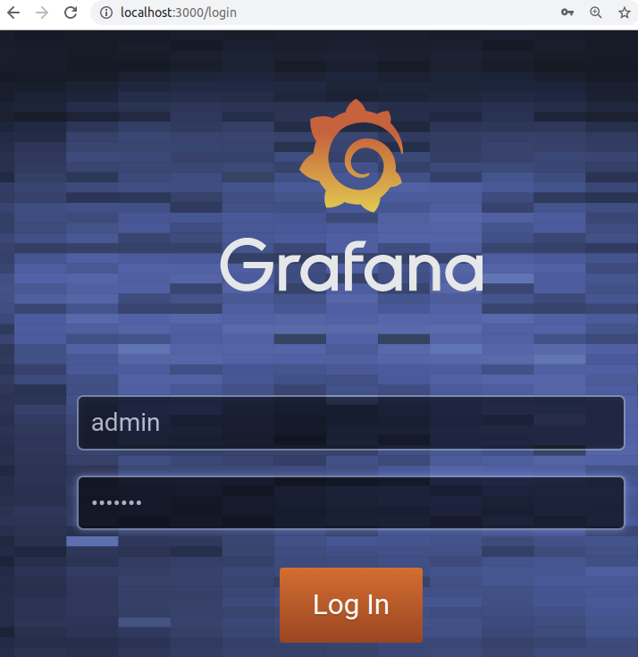
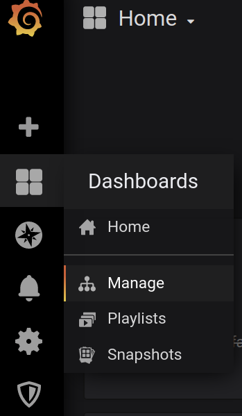
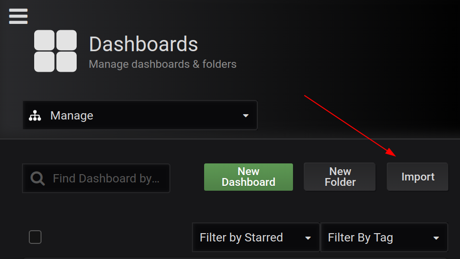
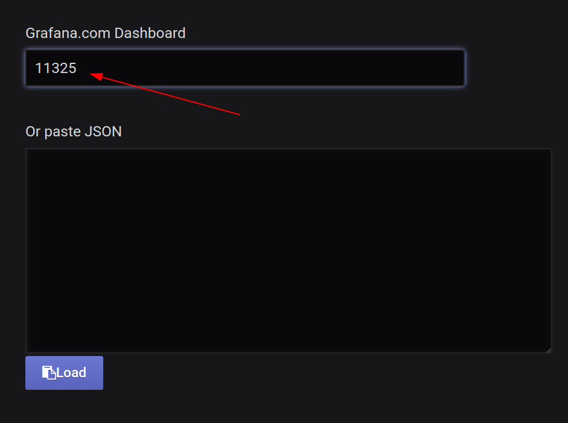
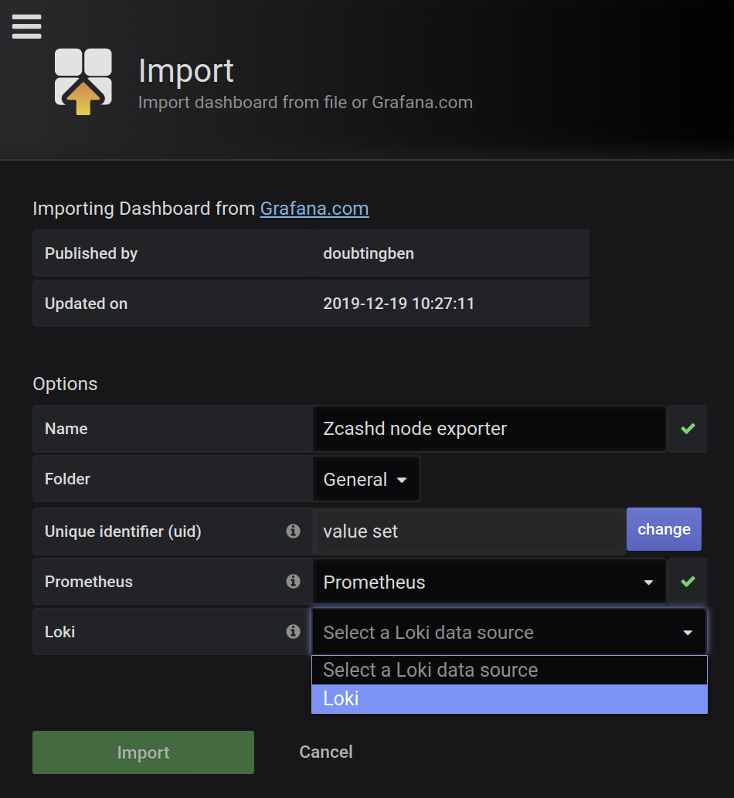
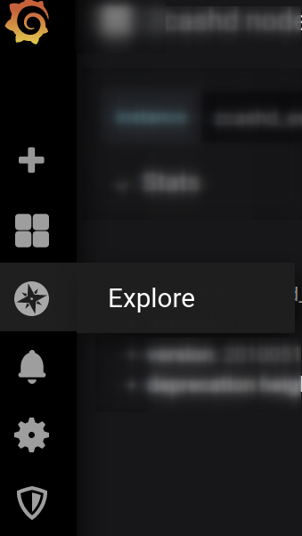
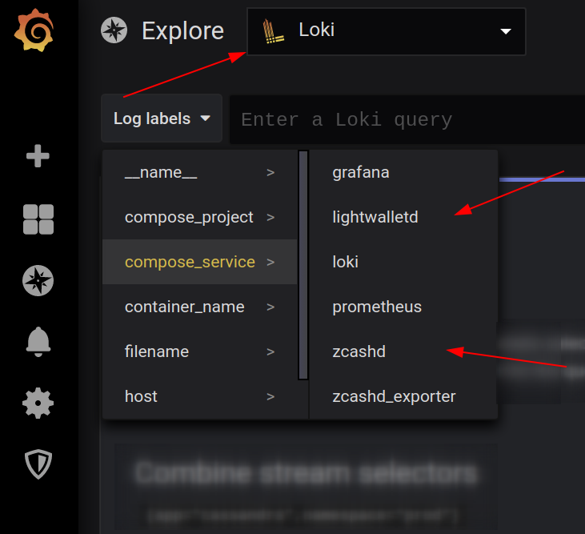
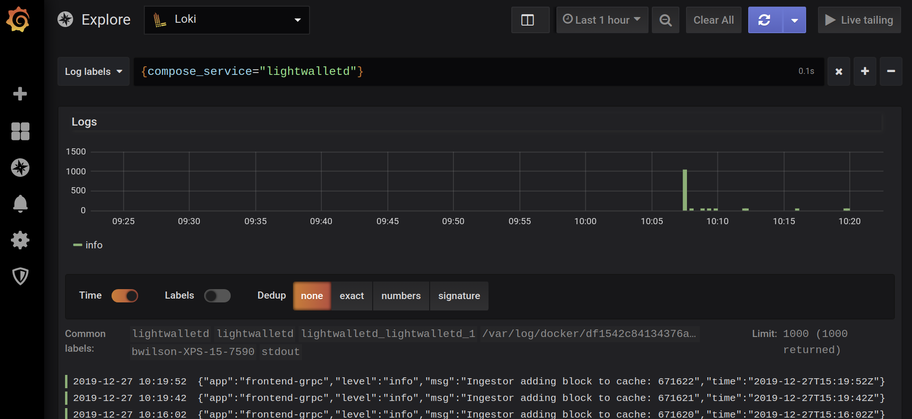
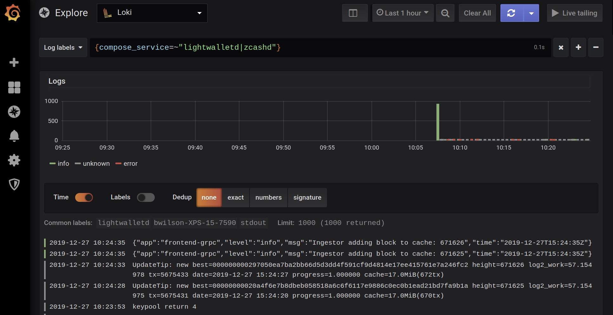

# Installation and setup

## Install requirements
- [docker](https://docs.docker.com/install/)  
- [docker-compose](https://docs.docker.com/compose/install/)
- loki plugin for docker logs
```
docker plugin install grafana/loki-docker-driver:latest --alias loki --grant-all-permissions
```

## Setup .env file

Copy `.env.example` to `.env` and change any required parameters.

| Variable        | Usage           | 
| ------------- |:-------------:|
|   `GF_SECURITY_ADMIN_USER`   |    Grafana admin user name   |
|   `ZCASHD_RPCUSER`   |    pirated rpc user   |
|   `ZCASHD_RPCPASSWORD` | pirated rpc password |
|   `ZCASHD_RPCPORT`   |    pirated rpc port   |
|`ZCASHD_ALLOWIP`| pirated rpc allowed IPs (don't change unless you know what you're doing)|
|`ZCASHD_DATADIR`| local location of pirated data directory. `uid` 2001 needs write access|
|`ZCASHD_PARMDIR`| local location of pirated data directory. `uid` 2001 needs read access|
|`ZCASHD_NETWORK`| pirated network to use, `testnet` or `mainnet`|
|`ZCASHD_GEN`| should pirated mine? `0` or `1`
|`LWD_PORT`| port for lightwalletd to bind to|
|`ZCASHD_CONF_PATH`| path for lightwalletd to pick up configuration|


## Populate secret env vars with random values

```
./buildenv.sh | tee .env
```

## Edit the two pirate.conf files
There are two pirate.conf files; one read by pirated, one read by lightwalletd.

### `$ZCASHD_DATADIR/pirate.conf`—read by pirated
The pirated's `pirate.conf` needs to look like: 
```
rpcuser=piraterpc
rpcpassword=TODO INSERT A RANDOM PASSWORD HERE
experimentalfeatures=1
lightwalletd=1
```

Replace `TODO INSERT A RANDOM PASSWORD HERE` with a random password, e.g. the output of `head -c 16 /dev/urandom | base64`.

`rpcuser` and `rpcpassword` must be set, as lightwalletd doesn't work with RPC cookies (see the [rpcpassword](https://pirate.readthedocs.io/en/latest/rtd_pages/pirate_conf_guide.html) documentation) for authentication.

`rpcuser` and `rpcpassword` in `.env` are only used by pirated_exporter, but they also must be the same values as in `$ZCASHD_DATADIR/pirate.conf`

### `lightwalletd/docker/pirate.conf`—read by lightwalletd
The other `pirated.conf`—the one read by lightwalletd—needs to have `rpcbind` (the address of the pirated it will connect to) set to `pirated`, and then docker-compose networking will make it resolve to the right IP address. Also, it needs to have the same `rpcuser` and `rpcpassword` values that are listed in `$ZCASHD_DATADIR/pirate.conf` to be able to authenticate.


## Build initial local docker image

`docker-compose build`

## Start the project

```
docker-compose up -d
```

# Setup and use Grafana

Open a browser to http://localhost:3000




Login with the user (`GF_SECURITY_ADMIN_USER`) and password (`GF_SECURITY_ADMIN_PASSWORD`).  
The values can be found in your `.env` file

Open the `Dashboard Manage` menu on the left

 

Select `Import`



Enter `11325` for the `Grafana.com Dashboard`



On the next screen, select the `Prometheus` and `Loki` values (there should only be 1 to select)



Click `Import`


This should then be taken to the `Pirated node exporter` dashboard.


If all goes as planned, the dashboard should start populating data from the container services.

If there are any issues, you can view all the `docker-compose` services under the `Explore` section.

# Viewing container logs

Open the `Explore` menu entry



Make sure `Loki` is selected as the datasource at the top.



Then choose the container to view it's logs.



Loki as a rich query syntax to help with log in many ways, for example combine 2 container logs entries:



See more here: https://github.com/grafana/loki/blob/master/docs/logql.md


# Exposing `lightwalletd` to the network

Edit `docker-compose.yml` to look like

```
    ports:    
      #- "127.0.0.1:$LWD_GRPC_PORT:$LWD_GRPC_PORT"
      #- "127.0.0.1:$LWD_HTTP_PORT:$LWD_HTTP_PORT"           
      - "0.0.0.0:$LWD_GRPC_PORT:$LWD_GRPC_PORT"
      - "0.0.0.0:$LWD_HTTP_PORT:$LWD_HTTP_PORT"      
```

When you edit these lines in `docker-compose.yml`, stopping/starting the individual `lightwalletd` container doesn't actually make the changes happen—you have to stop/start the whole `docker-compose` ensemble of containers because the ports/network config stuff lives at that level and doesn't seem to be affected by individual container stop/starts. Also if you want to expose `lightwalletd` to the whole internet, you don't need to specify an IP address, `0.0.0.0` works as it should.
